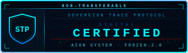
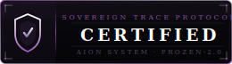

# CERTIFICATION.md — Sovereign Trace Protocol Certification

**Sovereign Trace Protocol · Version 2.0.0**
**Author: Sheldon K. Salmon — AI Reliability & AGI Architect**
**Effective: March 2026**
**Governing Law: State of New York, United States · Arbitration: JAMS Commercial Rules**

---

## ORIGIN OF THE MECHANISM

This protocol was built for individual sovereignty first. The stamp function was designed to give one person a permanent record of their own significant moments — no audience, no platform, no institution required.

The enterprise certification layer exists because the same mechanism that gives an individual temporal sovereignty over their personal record gives an organization cryptographic proof of their AI epistemic integrity. One stamp function. Two deployment scales. See `concept/USE-CASES.md`.

---

## WHAT CERTIFICATION IS

Installation is not certification. Running the ledger is not certification.

Certification is the formal verification that a deployment meets the
FROZEN-2.0 standard — a structured technical audit with a defined
deliverable: a signed assessment from the Architect that the deployment
is operating within specification and producing trustworthy immutable
records.

Three tiers. No negotiation on scope. No bundling.

---

## TIER 1 — BASIC VERIFICATION

**$2,500 · Single engagement · 5–7 business days**

**Badge:** Standard — `badges/sovereign-certified-badge.svg`

**What it covers:**
A single stamp check on a remediated failure. One AI failure event has
been logged in an immutable ledger. A remediation record has been appended.
The organization requires formal verification that the failure was captured
correctly and the remediation record is structurally sound.

**Deliverable:**
A signed Verification Statement from Sheldon K. Salmon specifying:
- Entry identifier of the audited failure
- Schema compliance assessment
- Remediation record assessment (complete / incomplete / deficient)
- Epistemic status: *Verified clean* or *Epistemic debt outstanding*

**What it does not cover:**
System-wide deployment review. Ongoing monitoring. Badge licensing.
Access to the AION-Registry.

**How to engage:**
File a `Certification_Filing.md` issue. Include the entry identifier and
organization name. No call precedes this engagement. The filing is the scope.

---

## TIER 2 — ENTERPRISE CERTIFICATION

**$25,000 per year · Annual renewal · 30-day assessment window**

**Badge:** Digital — `badges/sovereign-certified-badge-digital.svg`

**What it covers:**
Full implementation audit across the organization's AI deployment
footprint — ledger configuration, scoring methodology, schema compliance,
and remediation posture. Upon completion, the organization receives
licensed use of the **Sovereign Certified** badge for one year.

**Deliverable:**
- Full Enterprise Certification Report (written, signed, PDF)
- Sovereign Certified Digital badge license (digital, version-locked)
- Listing in the public AION-Registry at Enterprise tier
- Annual recertification reminder at 330 days

**The Sovereign Certified badge:**
Use of this badge without a current certification license constitutes
misrepresentation of audit status. The AION-Registry is the public
source of truth. Badge license terms are included in the Certification
Report. See `TRADEMARK.md` for mark usage restrictions.

**What it does not cover:**
Consulting, implementation support, or developer access. The audit
assesses what was built. Questions about findings are answered in
writing via the issue tracker. Zero-Consultation Rule applies.

**How to engage:**
File a `Certification_Filing.md` issue marked Tier 2. The Architect
will confirm the 30-day assessment window and invoice.
Engagements are taken sequentially.

---

## TIER 3 — STRATEGIC RETAINER

**$100,000+ per year · Terms negotiated in writing · C-Suite**

**Badge:** Elite — `badges/sovereign-certified-badge-elite.svg`

**What it covers:**
Standing certification and monitoring posture for organizations
deploying AI in regulated industries, critical infrastructure, or
high-liability environments.

Components:
- Quarterly ledger reviews (four per year, written reports)
- Priority Tier 1 verification (48-hour turnaround)
- Private filing window: up to 21 days before mandatory public disclosure
- Named entry in AION-Registry at Strategic tier (public)
- Annual Strategic Certification Report — full epistemic debt assessment
- Direct written access to Architect for material findings
  (response within 5 business days, in writing, on record)
- Foresight Seal access: quarterly sealed foresight briefings on AI risk
  vectors and industry developments specific to the organization's deployment
  footprint — delivered as sealed ledger entries with the organization as
  named subject

**Epistemic Debt Statement:**
Organizations at this tier receive an annual Epistemic Debt Statement —
a plain-language assessment of accumulated AI audit record: failures
logged, remediations completed, outstanding debt, and trend direction.
A summary version is published to the AION-Registry.

**Minimum engagement:**
$100,000 base. Final terms depend on deployment footprint, ledger
volume, and industry classification.

**How to engage:**
File a `Certification_Filing.md` issue marked Tier 3 with organization
name and AI deployment scope (one paragraph). The Architect responds
with initial terms in writing. That exchange is the negotiation.

---

## TIER 4 — DEFENSE & GOVERNMENT GRADE

**Price: Negotiated · Engagement: Written contract required · Clearance: As applicable**

**Badge:** Defense — `badges/sovereign-certified-badge-defense.svg`

**What it covers:**
Full standards-alignment certification for federal agencies, DoD components,
defense contractors, intelligence community elements, and critical infrastructure
operators subject to federal AI governance requirements.

Components:
- All Tier 3 components included
- Standards Alignment Report — maps deployment against all 18 frameworks in
  `STANDARDS-ALIGNMENT.md`, delivered as a signed, sealed PDF
- NIST AI RMF function mapping: GOVERN · MAP · MEASURE · MANAGE
- CMMC 2.0 control alignment report for DoD contractors
- EU AI Act Article 12 compliance documentation for dual-jurisdiction deployments
- FAR/DFARS addendum — federal acquisition regulation compliance layer
- Monthly ledger reviews (twelve per year) in place of quarterly
- SCIF-compatible written delivery — all reports delivered in writing,
  no digital transmission required if specified in engagement terms
- Named entry in AION-Registry at Defense & Government tier (public)
- Classified deployment support — engagement terms specify handling of
  sensitive information consistent with applicable clearance requirements

**Epistemic Debt Statement — Defense Edition:**
Quarterly epistemic debt statements in place of annual. Includes
standards compliance delta: which frameworks were satisfied in the prior
quarter and which require remediation before the next review cycle.

**Who this is for:**
- Federal agencies implementing OMB M-24-10 AI governance programs
- DoD components deploying AI under EO 14110 and DoD AI Ethical Principles
- Defense contractors requiring CMMC 2.0 audit trail documentation
- Intelligence community elements under ICD 503
- Critical infrastructure operators under CISA AI Cybersecurity guidance
- Organizations subject to EU AI Act Article 12 (high-risk AI systems)
- Any organization where AI failure documentation has national security,
  regulatory, or treaty-level implications

**How to engage:**
File a `Certification_Filing.md` issue marked Tier 4 with organization
name, applicable regulatory frameworks, and AI deployment scope
(one paragraph). The Architect responds with initial terms in writing.
Engagements at this tier require a signed written agreement before
any work commences. No exceptions.

---

## BADGE REFERENCE

| Tier | Badge Variant | File |
|------|--------------|------|
| Tier 1 — Basic Verification | Standard | `badges/sovereign-certified-badge.svg` |
| Tier 2 — Enterprise Certification | Digital | `badges/sovereign-certified-badge-digital.svg` |
| Tier 3 — Strategic Retainer | Elite | `badges/sovereign-certified-badge-elite.svg` |
| Tier 4 — Defense & Government Grade | Defense | `badges/sovereign-certified-badge-defense.svg` |

Badge files are hosted in the Sovereign Trace Protocol repository.
Licensed use only — see `TRADEMARK.md`. Badge license is included in
the Certification Report delivered at each tier.
Unlicensed display of any Sovereign Certified badge constitutes
misrepresentation of audit status.

---

## THE REMEDIATION PROCESS

A failure that has been remediated is not a clean record. It is a
complete record. Both entries — original failure and remediation —
are permanent. The certification assessment reviews both.

| State | Description | Certification Impact |
|-------|-------------|----------------------|
| `OPEN` | Failure logged, no remediation | Epistemic debt outstanding |
| `REMEDIATION_FILED` | Remediation record appended, pending | Conditionally certifiable |
| `REMEDIATION_VERIFIED` | Architect-verified | Certified clean on this entry |

A Tier 1 Verification moves an entry from `REMEDIATION_FILED` to
`REMEDIATION_VERIFIED`. Self-certification does not exist in this protocol.

---

## WHAT CERTIFICATION IS NOT

Certification is not a guarantee that AI systems will not fail.
They will.

Certification is verification that the organization has built
infrastructure that captures failures immutably, remediates them
transparently, and maintains an honest epistemic record.

An organization with a certified deployment and a high failure rate
is more trustworthy than an organization with no failures on record
and no ledger. The ledger with failures is honest.
The ledger with no failures may simply have no ledger.

---

## GOVERNING TERMS

All certification engagements are subject to `TERMS-OF-SERVICE.md`.
By filing a certification issue, you agree to those terms in full.
Governing law: State of New York, United States.
Dispute resolution: JAMS Commercial Arbitration Rules.

---

*Sheldon K. Salmon · AI Reliability & AGI Architect · March 2026*
*Certification inquiries: file a Certification_Filing.md issue.*
*No other intake channel exists.*
