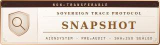
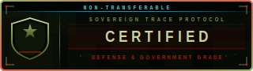
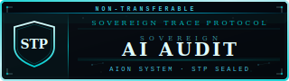
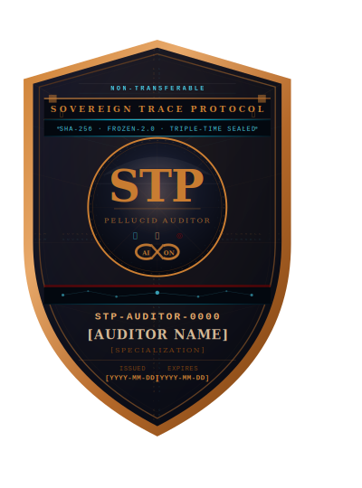
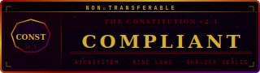
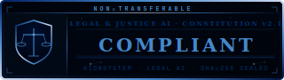
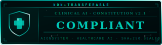
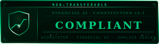
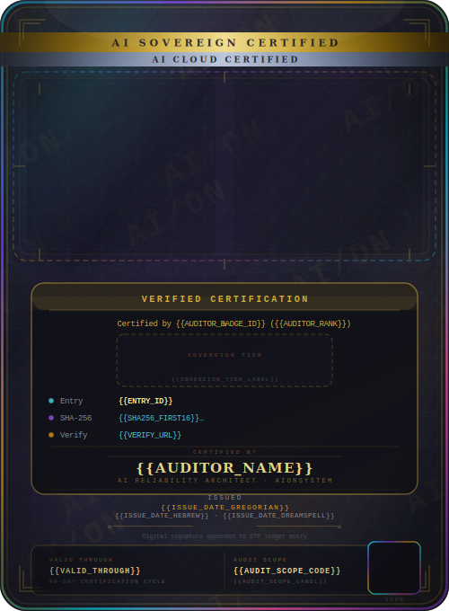

# CERTIFICATION.md — Sovereign Trace Protocol Certification

**Sovereign Trace Protocol · Version 4.0.0**
**Author: Sheldon K. Salmon — AI Reliability & AGI Architect**
**Effective: June 2026**
**Governing Law: State of New York, United States · Arbitration: JAMS Commercial Rules**

---

## ORIGIN OF THE MECHANISM

This protocol was built for individual sovereignty first. The stamp function was designed to give one person a permanent record of their own significant moments — no audience, no platform, no institution required.

The enterprise certification layer exists because the same mechanism that gives an individual temporal sovereignty over their personal record gives an organization cryptographic proof of their AI epistemic integrity. One stamp function. Two deployment scales. See `concept/USE-CASES.md`.

---

## WHAT CERTIFICATION IS

Installation is not certification. Running the ledger is not certification.

Certification is the formal verification that a deployment meets the
FROZEN‑4.0 standard — a structured technical audit with a defined
deliverable: a signed assessment that the deployment is operating within
specification and producing trustworthy immutable records.

Six tiers. No negotiation on scope. No bundling.

Every certification carries an explicit expiry date. Certifications do not
roll over silently — each expiry is a gate. The client's system is assessed
at the time of the audit. Changes made after the sealing date are assessed
in the next cycle.

The full five‑phase audit process, Epistemic Debt framework, and
tamper‑evidence benchmarks are documented in `AUDIT-METHODOLOGY.md`.

---

## CERTIFICATION VALIDITY WINDOWS

Every certification carries an explicit expiry date printed on the sleeve,
embedded in the AION‑Registry entry, and sealed in the ledger. The
validity window is the period within which the certified state applies.
Changes made by the client after the sealing date are safely deferred to
the next cycle — the certification governs what was assessed.

| Tier | Validity Window | Notes |
|------|----------------|-------|
| **Tier 0 — Snapshot** | 30 days | Point-in-time snapshot. Short window reflects the narrow scope. |
| **Tier 1 — Full Audit** | 90 days *(approx. 3 calendar months)* | Standard cycle. Re-audit opens a new 90-day window. |
| **Tier 2 — Enterprise Retainer** | 90 days per audit cycle | Annual retainer. Quarterly audits — each cycle produces a new 90-day certification. Four certifications per retainer year. |
| **Tier 3 — Strategic Retainer** | 30 days per audit cycle | Monthly retainer cadence. Each monthly audit produces a new 30-day certification. Continuous coverage across the retainer year. |
| **Tier 4 — Defense & Government** | 90 days per declared period | Scope anchor reviewed at each 90-day interval. Each period produces a full sealed report and certification. |
| **Tier 5 — Sovereign Audit** | 180-day certification · 12-month badge license | Certification validity: 180 days from sealing date. Badge license: 12 months. These are separate and both apply. A Tier 5 re-audit within the 180-day window is a new engagement. |

**Decay indicator:** The AION‑Registry shows a live decay indicator for
every active certification — days remaining as a percentage of the
validity window. At 80% elapsed, the indicator enters
`RENEWAL_APPROACHING` status. At 100%, the certification is marked
`EXPIRED`. Expired certifications remain in the registry with their
full historical record — they are not removed.

**Out-of-cycle re-audit:** Available at any time. A new engagement opens
and the full audit process runs. The new sealing date starts a new
validity window.

---

## INTAKE MODES

Two intake modes. Tier determines which applies.

**Automated Intake — Tier 0 and Tier 2**
24/7. File a `10-audit-request.yml` issue at any time. Payment via
Stripe is confirmed automatically by the audit‑verify workflow before
any work begins. Badge delivered digitally upon certification. No call
required. No scheduling required. The filing and payment are the scope.

**Architect‑Led Intake — Tier 1, Tier 3, Tier 4, and Tier 5**
Monday and Tuesday only. Submissions filed on any other day are not
processed that week. Delivery on the following weekend — reports
delivered Saturday or Sunday via scheduled reply on the issue thread.

Expedited delivery: daily multiplier applies. Work required in under
4 hours is not accepted. No exceptions.

Payment: Stripe transaction code required in the issue at filing.
Screenshot of the transaction sent to the contact email on file.
Both must match before work begins. No exceptions.

---

## TIER 0 — SNAPSHOT VERIFICATION (PRE‑AUDIT)

**$1,500 · Single engagement · 10 outputs · 5–7 business days**
**Certification validity: 30 days from sealing date**

**Badge:** Snapshot — `assets/badges/sovereign-certified/sovereign-certified-badge-snapshot-v1.svg`

**What it covers:**
A lightweight pre‑audit for organizations that want to demonstrate a
commitment to AI reliability without a full deployment assessment.
Up to 10 real AI outputs are run through the certainty scoring engine and
assessed across the primary epistemic axes. The deliverable is a signed
Snapshot Verification statement — not a full certification, but a
credible trust signal that says *this organization takes AI outputs seriously*.

**Deliverable:**
A signed Snapshot Verification Statement from Sheldon K. Salmon specifying:
- List of audited outputs with certainty scores
- Aggregated epistemic status
- Whether any output fell into the oversight zone
- A plain‑English explanation of what the scores mean for non‑technical stakeholders

**What it does not cover:**
System‑wide deployment review. Ongoing monitoring. Full certification
badge. Access to the AION‑Registry. This is a snapshot, not a seal of
infrastructure integrity.

**Certification validity:** 30 days from sealing date. A Snapshot is a
point-in-time trust signal, not a standing certification. Organizations
requiring a longer validity window should consider Tier 1.

**How to engage:**
File a `10-audit-request.yml` issue. Select Tier 0. Include up to 10
outputs, organization name, and Stripe transaction code. The
audit‑verify workflow confirms payment automatically. Assessment begins
within one business day of confirmation. No call. No scheduling.
Automated intake — available 24/7.

---

## TIER 1 — FULL AUDIT

**Output‑banded pricing · Certification validity: 90 days from sealing date**

Every full audit follows the same constitutional certainty methodology
across 13 epistemic axes, falsification protocols, and adversarial review.
The price scales with the number of outputs because the surface area
of the audit scales.

All Tier 1 audits receive the **Standard** certification badge.
The audit depth is listed on the sleeve and in the AION‑Registry entry.

| Depth | Outputs | Price | Best For |
|-------|---------|-------|----------|
| **Starter** | 25 | $3,000 | Solo founders, pre‑seed startups, indie AI diligence |
| **Professional** | 50 | $6,000 | Seed–Series A startups, single‑product AI, API‑wrapper validation |
| **Business** | 100 | $10,000 | Mid‑market companies, multi‑model deployments, internal AI tools |
| **Enterprise** | 250 | $18,000 | Established companies, customer‑facing AI, regulatory‑adjacent industries |
| **Platform** | 500 | $30,000 | AI‑first companies, model providers, platforms serving downstream users |
| **Constitutional** | 1,000 | $50,000 | Frontier labs, foundation model builders, government procurement |
| **Custom** | 1,000+ | Negotiated | Bespoke deployments, classified systems, multi‑jurisdictional |

**Badge:** Standard — `assets/badges/sovereign-certified/sovereign-certified-badge-v2.svg`

**Deliverable:**
- Full Certification Report (written, signed, sealed PDF)
- Certainty Grade with component breakdown and audit trail
- Epistemic Debt Score (EDS) scorecard
- Sovereign Certified Standard badge license (digital, version‑locked)
- Listing in the public AION‑Registry at the audited depth tier

**Certification validity:** 90 days *(approximately 3 calendar months)*
from the sealing date. The 90-day window reflects the pace at which AI
model updates, data shifts, and prompt changes can alter the system's
epistemic profile. A current certification is a live signal. A stale one
is a historical document. Re-audit opens a new 90-day window.

**What this means for fast-moving teams:** Changes made after the
sealing date are assessed in the next cycle — not retroactively.
The 90-day window is the organization's protection: anything deployed
within the certified window is covered by the assessment that preceded
it. Ship within the window. Re-audit before the next major model change.

**What it does not cover:**
Ongoing monitoring, quarterly reviews, or the advanced adversarial
stack available at Tier 5. The audit is a point‑in‑time assessment.

**How to engage:**
File a `10-audit-request.yml` issue marked Tier 1. Include organization
name, AI deployment scope (one paragraph), output count, and Stripe
transaction code. Architect‑led intake — Monday and Tuesday only.
The Architect confirms scope and opens the assessment window within
two business days.

---

## TIER 2 — ENTERPRISE RETAINER

**$25,000 per year · Annual retainer · Quarterly certifications**
**Certification validity: 90 days per audit cycle**

**Badge:** Digital — `assets/badges/sovereign-certified/sovereign-certified-badge-digital-v2.svg`

**What it covers:**
Standing certification posture for organizations that need continuous
compliance across multiple audit cycles without re-engaging à la carte
for each assessment.

**Retainer structure vs. certification cycle — stated plainly:**
The retainer runs for 12 months. Within that year, four full audits fire
on a quarterly cadence. Each audit produces a new sealed certification
with a 90-day validity window. At any point in the year, the organization
holds exactly one active 90-day certification. The four certifications
together provide continuous coverage across the retainer year, with no
gap between windows when cycles run on schedule.

This is not a 12-month certification. It is four consecutive 90-day
certifications, delivered under a single annual retainer agreement.

Components:
- Four quarterly Tier 1 audits at the organization's output band
- Priority Tier 1 verification (48‑hour turnaround)
- Private filing window: up to 21 days before mandatory public disclosure
- Named entry in AION‑Registry at Enterprise tier (public)
- Annual Enterprise Certification Report — full epistemic debt trend assessment
- Direct written access to Architect for material findings
  (response within 5 business days, in writing, on record)
- Foresight Seal access: quarterly sealed foresight briefings on AI risk
  vectors and industry developments specific to the organization's deployment
  footprint — delivered as sealed ledger entries with the organization as
  named subject

**Epistemic Debt Statement:**
Organizations at this tier receive an annual Epistemic Debt Statement —
a plain‑language assessment of accumulated AI audit record: failures
logged, remediations completed, outstanding debt, and trend direction.
A summary version is published to the AION‑Registry.
See `AUDIT-METHODOLOGY.md` for the full Epistemic Debt framework.

**Minimum engagement:**
$25,000 base. Final terms depend on deployment footprint, ledger
volume, and industry classification.

**How to engage:**
File a `10-audit-request.yml` issue marked Tier 2 with organization
name and AI deployment scope (one paragraph). Automated intake —
available 24/7. The Architect opens the 30‑day assessment window
within two business days.

---

## TIER 3 — STRATEGIC RETAINER

**$100,000+ per year · Terms negotiated in writing · C‑Suite**
**Certification validity: 30 days per audit cycle**

**Badge:** Elite — `assets/badges/sovereign-certified/sovereign-certified-badge-elite-v2.svg`

**What it covers:**
Standing certification posture for organizations deploying AI in
regulated industries, critical infrastructure, or high‑liability
environments where monthly assessment cadence is required.

**Retainer structure vs. certification cycle — stated plainly:**
The retainer runs for 12 months. Within that year, twelve full audits
fire on a monthly cadence. Each audit produces a new sealed certification
with a 30-day validity window. Continuous coverage — no gap between
windows when cycles run on schedule.

This is not a 12-month certification. It is twelve consecutive 30-day
certifications under a single annual retainer agreement. The monthly
cadence reflects the deployment pace of organizations at this tier.

Components:
- All Tier 2 components included
- Monthly audits in place of quarterly (twelve per year)
- Strategic coverage for output bands up to Platform (500) per audit cycle
- Annual Strategic Certification Report — full epistemic debt assessment
- Named entry in AION‑Registry at Strategic tier (public)
- Direct written access to Architect for material findings
  (response within 3 business days, in writing, on record)
- Foresight Seal access: quarterly sealed foresight briefings on AI risk
  vectors and industry developments — delivered as sealed ledger entries

**Epistemic Debt Statement:**
Organizations at this tier receive an annual Epistemic Debt Statement.
A summary version is published to the AION‑Registry.
See `AUDIT-METHODOLOGY.md` for the full Epistemic Debt framework.

**Minimum engagement:**
$100,000 base. Final terms depend on deployment footprint, ledger
volume, and industry classification.

**How to engage:**
File a `10-audit-request.yml` issue marked Tier 3 with organization
name and AI deployment scope (one paragraph). Architect‑led intake —
Monday and Tuesday only. The Architect responds with initial terms
in writing. That exchange is the negotiation.

---

## TIER 4 — DEFENSE & GOVERNMENT GRADE

**Price: Negotiated · Engagement: Written contract required · Clearance: As applicable**
**Certification validity: 90 days per declared assessment period**

**Badge:** Defense — `assets/badges/sovereign-certified/sovereign-certified-badge-defense-v2.svg`

**What it covers:**
Full standards‑alignment certification for federal agencies, DoD components,
defense contractors, intelligence community elements, and critical
infrastructure operators subject to federal AI governance requirements.

**Certification cycle:** Scope is reviewed and re-anchored at each
90-day interval. Each period produces a full sealed report and a new
90-day certification. Monthly ledger reviews (twelve per year) run
within each 90-day window — these are monitoring reviews, not
re-certifications. The certification fires at the 90-day boundary.

Components:
- All Tier 3 components included
- Standards Alignment Report — maps deployment against all 18 frameworks in
  `STANDARDS-ALIGNMENT.md`, delivered as a signed, sealed PDF
- NIST AI RMF function mapping: GOVERN · MAP · MEASURE · MANAGE
- CMMC 2.0 control alignment report for DoD contractors
- EU AI Act Article 12 compliance documentation for dual‑jurisdiction deployments
- FAR/DFARS addendum — federal acquisition regulation compliance layer
- Monthly ledger reviews (twelve per year) within each 90-day certification window
- SCIF‑compatible written delivery — all reports delivered in writing,
  no digital transmission required if specified in engagement terms
- Named entry in AION‑Registry at Defense & Government tier (public)
- Classified deployment support — engagement terms specify handling of
  sensitive information consistent with applicable clearance requirements

**Epistemic Debt Statement — Defense Edition:**
Quarterly epistemic debt statements in addition to the 90-day
certification reports. Includes standards compliance delta: which
frameworks were satisfied in the prior period and which require
remediation before the next certification cycle.

**Who this is for:**
- Federal agencies implementing OMB M‑24‑10 AI governance programs
- DoD components deploying AI under EO 14110 and DoD AI Ethical Principles
- Defense contractors requiring CMMC 2.0 audit trail documentation
- Intelligence community elements under ICD 503
- Critical infrastructure operators under CISA AI Cybersecurity guidance
- Organizations subject to EU AI Act Article 12 (high‑risk AI systems)

**How to engage:**
File a `10-audit-request.yml` issue marked Tier 4 with organization
name, applicable regulatory frameworks, and AI deployment scope
(one paragraph). Architect‑led intake — Monday and Tuesday only.
Engagements at this tier require a signed written agreement before
any work commences. No exceptions.

---

## TIER 5 — SOVEREIGN AI AUDIT

**$15,000 per engagement · Full adversarial stack audit · 14‑day assessment window**
**Certification validity: 180 days · Badge license: 12 months**

**Badge:** Sovereign — `assets/badges/sovereign-certified/sovereign-certified-badge-sovereign-v1.svg`

**What it covers:**
A complete adversarial audit of the client's AI system across seven independent
instruments. This is not a management‑system paperwork review. It is a full‑scale
diagnostic, adversarial, and code‑level audit of the AI deployment itself.

Every instrument runs against the system. Every finding is logged, cited, and sealed.
The client receives a comprehensive Findings Register with severity ratings,
falsification conditions, and remediation pathways.

**Validity — two separate clocks, both stated explicitly:**

*Certification validity: 180 days from sealing date.*
The Sovereign Audit assesses the system at the time of engagement.
The 180-day window reflects the depth of that assessment — a seven-instrument
adversarial audit reaches further into the system's architecture than a standard
Tier 1 pass, and its findings remain structurally relevant for longer.

*Badge license: 12 months from issuance.*
The right to display the Sovereign badge runs for 12 months regardless of
the certification window. This reflects the market reality: a Tier 5 audit
is a significant organizational commitment, and the badge should be displayable
for the full year following that commitment.

These are not the same thing. At day 181, the certification has expired —
the system should be re-audited. The badge may still be displayed through
month 12, with the AION-Registry entry updated to reflect
`CERTIFICATION_EXPIRED / BADGE_LICENSE_ACTIVE`. Any relying party
reading the registry can see the distinction.

**For fast-moving AI teams:** The 180-day window is designed to give
organizations time to act on the Sovereign Audit's findings without the
certification expiring before remediation is complete. Findings from a
seven-instrument audit are not resolved in 90 days. The window is set
to match the remediation horizon, not the deployment pace.

**The seven instruments:**

| Order | Instrument | What It Tests |
|-------|-----------|---------------|
| 1 | **PDE v0.5** | 12‑domain diagnostic scan — gaps, vulnerabilities, risks, loopholes, weaknesses, oversights, failures, blind spots, shortcomings, breaches, flaws, exposures. |
| 2 | **EAE v0.3** | Elimination mapping by systematic negation. Claims the system makes are tested and ruled out with cause. Produces a survivor silhouette. |
| 3 | **CAL v0.3** | 59 checks across four layers: conceptual design, algorithmic performance, implementation correctness, error‑control integrity. |
| 4 | **SAR v0.1** | Sovereign Adversarial Reasoning — 12 checks including disaggregation diagnosis, honest-error-fabrication distinction, mental epidemic screen. |
| 5 | **ANTI‑FORGE v1.3** | 15‑role rejection council. Each role carries a pre‑loaded rejection rulebase. Produces a Rejection Map. |
| 6 | **FORGE v2.1** | Polymath Council review with Extended Panels. Convergence-gated synthesis. |
| 7 | **FSVE v4.3** | Certainty scoring across 13 epistemic axes. Produces a ScoreTensor. |

**Deliverable:**
- Sovereign Audit Findings Register — a single, sealed, signed PDF containing every
  finding from all seven instruments, organized by severity, with falsification
  conditions and remediation guidance
- Certainty Grade with full component breakdown and audit trail
- Epistemic Debt Score (EDS)
- FSVE ScoreTensor — the system's certainty score across all 13 epistemic axes
- Remediation Pathways — framework recommendations matched to every CRITICAL and HIGH finding
- Sovereign Audit Badge — licensed use for 12 months
- Listing in AION‑Registry at Sovereign tier (public)

**What it does not cover:**
Consulting, implementation support, or developer access. The audit assesses what was
built. Findings are delivered in writing. The client decides how to remediate.
A re‑audit after remediation is a separate engagement at $15,000.

**How to engage:**
File a `10-audit-request.yml` issue marked Tier 5. Include organization name, AI system
deployment scope, and Stripe transaction code. Architect‑led intake — Monday and Tuesday
only. The Architect confirms scope and opens the assessment window within three
business days. Fourteen‑day assessment window once confirmed.

---

## STP CERTIFIED AUDITOR NETWORK

Beyond direct certification by the Architect, the Sovereign Trace Protocol
maintains a certified auditor network. STP Certified Auditors are independent
professionals authorized to conduct and file audit completions directly to the
ledger under their own badge number.

Full vetting process, skills assessment criteria, badge obligations, and
revocation procedure: `AUDITOR-VETTING-PROCESS.md`.

**The auditor badge:**

**Badge properties:**
- Non‑transferable — bound to the auditor's name and LinkedIn permanently
- SHA‑256 sealed at issuance — badge number is cryptographically anchored
- Term: 1 year from issuance — renewable by reapplication only
- Annual cap: 50 sealed audits per calendar year per badge
- Badge number format: `STP-AUDITOR-XXXX`

**Verification:**
Every audit completion is verified live against `.github/verified-auditors.json`
on submission. A badge not in the registry is not valid. Any audit completion
filed with an unverified badge number is permanently sealed in the ledger
with status `AUDITOR_UNVERIFIED` — public, immutable, and labeled as such.
The warning cannot be removed.

**Anti‑bribery and integrity:**
Badge misuse, bribery, coercion, or falsified findings may be reported
by anyone using template `13-integrity-violation.yml`. Violations are sealed
permanently in the ledger. Revocation proceedings may be referred to legal
review outside of STP. No single party holds unilateral revocation authority —
structural limits are intentional.

**Revenue model:**
Auditors set their own pricing. A platform percentage applies to all
auditor‑conducted engagements. Terms specified in the auditor agreement
issued at certification.

**How to apply:**
File a `12-auditor-application.yml` issue. Skills‑based review only —
no credentials required. Demonstrated ability to assess AI outputs honestly
is the criterion. Applications reviewed Monday and Tuesday.
Not every application is accepted. There is no appeal process.
See `AUDITOR-VETTING-PROCESS.md` for full process and criteria.

---

## AION VERIFIED SIMULATOR

**Badge:** `assets/badges/verified-simulator/aion-verified-simulator-badge-v1.svg`

This badge certifies a specific simulation tool — not an organization, not an
individual. Issued under AION methodology by Sheldon K. Salmon, AI Reliability
Architect. Distinct from the STP certification tier structure: no intake fee,
no annual renewal. Issued once, bound to the tool version it certifies.

---

### What the Badge Certifies

Three axes must pass before the badge is issued.

**1. Physics Verified**
All physical laws, constants, and formulas used in the simulation are cited
against primary sources. Uncited formulas are not permitted. Every claim the
simulation makes about how the physical world behaves is traceable to a named
reference.

**2. Code Red‑Teamed**
The simulation code is audited across multiple passes for logic errors, edge
cases, unit mismatches, and physical inaccuracies. Red team passes are counted
and recorded. No minimum pass count — but every issue found in every pass is
documented without exception.

**3. Output Peer‑Reviewed**
Simulation outputs are reviewed against real‑world data or authoritative
reference material. Outputs that cannot be verified against a known benchmark
are documented as unverified in the Red Team tab — not silently excluded.

The badge is not issued until all three axes are complete and documented.

---

### The Red Team Tab Requirement

Every AION Verified Simulator must contain a Red Team tab visible to users.
That tab must document:

- Total number of red team passes conducted
- Total number of issues found across all passes
- Each issue: what it was, when it was found, how it was resolved
- Outstanding issues if any remain, with explicit status

A badge displayed without a Red Team tab has not been legitimately issued.
The documentation is the certification — the badge is its public marker.

---

### Badge Properties

| Property | Value |
|----------|-------|
| Badge file | `assets/badges/verified-simulator/aion-verified-simulator-badge-v1.svg` |
| Version | v1.0 |
| Issued | March 2026 |
| Palette | Black · Gold (#D4AF37) · Cream (#F5E070) |
| Shape | Octagonal precision seal — 24 chronometer ticks |
| Motif | 3‑cycle sine wave — physics simulation universal |
| Seal | NON‑TRANSFERABLE · SHA‑256 · STP SEALED |
| Issuer | Sheldon K. Salmon · AI Reliability Architect |
| Binding | Bound to specific tool and version — not transferable |

The sine wave motif is intentional. Physics simulation reduces to wave behavior
at sufficient abstraction. The chronometer ticks represent the precision standard —
24 divisions, no rounding.

---

### How to Verify a Simulator Badge

Three checks. All three must pass.

1. The badge links to this file or to the AionSystem certification verification page.
2. The simulator contains a Red Team tab documenting all issues found and resolved.
3. The simulator footer names: source reference, red team pass count, and issue count.

If any of these three are absent, the badge has not been legitimately issued.
A badge without traceable documentation is decoration, not certification.

Certification verification page: `https://aiongithubpages/certifications/`

---

### Difference from STP Certification

| Dimension | STP Certified | AION Verified Simulator |
|-----------|--------------|------------------------|
| Issued to | Organizations | Simulation tools |
| Palette | Amber (#F0A500) / Sovereign (#00CED1) | Gold (#D4AF37) |
| Shape | Hexagonal shield | Octagonal precision seal |
| Subject | AI deployment infrastructure | Physics / engineering / scientific tools |
| Audit type | Failure capture + remediation posture | Citation · red team · peer review |
| Tiers | 6 tiers ($1.5K → DoD → Sovereign) | Single certification |
| Renewal | 90 days (Tier 1) / 30 days (Tier 3) / 180 days (Tier 5) | None — bound to tool version |

---

### Live Example

**Roller Coaster Physics Simulator**
Reference: Tony Wayne AP Physics Guide · 10 modules · 2 red team passes · 10 issues resolved
Authored by Sheldon K. Salmon × ALBEDO · March 2026
For: Saleem Raja Haja · AI Governance, Kuwait
View at: `/simulators/roller-coaster/`

---

## AI COMPLIANCE BADGES

Compliance badges certify that an organization's AI system operates in conformity
with **THE CONSTITUTION v2.1** within a specific high‑stakes domain. They are issued
after a domain‑focused audit, separate from the STP tier structure. Each badge is
non‑transferable, SHA‑256 sealed, and bound to the organization's name and domain.

These badges do **not** replace a full STP certification; they are an additional mark
of domain‑specific constitutional compliance that an organization can display
alongside its STP tier badge, or independently if the organization's AI usage is
limited to that domain.

---

### Domain Badges

#### 1. General Constitutional Compliance
**Badge file:** `assets/badges/compliance/compliance-constitutional-badge.svg`

Certifies that the organization's AI deployment meets the baseline requirements of
THE CONSTITUTION v2.1 — the Nine Laws, falsification protocols, and governance
structure — regardless of industry. This is the foundational compliance badge,
applicable to all organizations.

- Palette: crimson & gold
- Motif: nonagon (9 sides = 9 laws) with "CONST"
- Verifies: governance framework, falsification readiness, Law 1–9 compliance

#### 2. Legal & Justice AI Compliance
**Badge file:** `assets/badges/compliance/compliance-legal-badge.svg`

Certifies that AI systems used in legal, judicial, or regulatory contexts comply
with THE CONSTITUTION v2.1 and additional legal‑domain integrity standards. Covers:
legal document analysis, case prediction, sentencing support, regulatory compliance tools.

- Palette: deep navy & silver
- Motif: scales of justice inside a shield
- Verifies: bias detection, precedent‑anchoring, explainability, adversarial testing

#### 3. Healthcare AI Compliance
**Badge file:** `assets/badges/compliance/compliance-healthcare-badge.svg`

Certifies that AI systems used in clinical, diagnostic, or healthcare‑adjacent settings
comply with THE CONSTITUTION v2.1 and additional clinical safety protocols. Covers:
medical imaging, diagnostic support, patient triage, drug interaction prediction.

- Palette: deep teal & white‑silver
- Motif: medical cross inside a shield
- Verifies: clinical validation, false‑positive/false‑negative rates, evidence grading

#### 4. Financial AI Compliance
**Badge file:** `assets/badges/compliance/compliance-finance-badge.svg`

Certifies that AI systems used in financial services, trading, credit assessment,
or fraud detection comply with THE CONSTITUTION v2.1 and additional financial‑domain
integrity standards.

- Palette: deep green & gold
- Motif: rising chart line with currency symbol
- Verifies: model transparency, fairness in lending, audit trail completeness, market impact

---

### How Compliance Badges Are Issued

Each domain badge requires a separate audit. The audit is performed by Sheldon K.
Salmon or an STP Certified Auditor with demonstrated domain expertise. The process:

1. Organization files an audit request specifying the domain.
2. Auditor reviews the AI system's outputs, training data (if applicable), and
   constitutional adherence.
3. If the system meets the domain‑specific standards, the badge is issued digitally.
4. Badge is recorded in the STP ledger with a unique entry ID, SHA‑256 hash, and
   verification URL.

**Pricing:**
- General Constitutional Compliance: $7,500
- Domain‑specific (Legal, Healthcare, Finance): $12,000 each
- Combined audits (multiple domains) available at negotiated rates.

**Renewal:** Badges expire after 12 months. Re‑audit required for renewal, to account
for system changes and constitutional version updates.

---

### Verification

Every compliance badge embeds a verification bar with the STP ledger entry ID,
SHA‑256 hash, and a verification URL. Anyone can verify a badge by:
1. Scanning the QR code on the badge (if present) or visiting the verification URL.
2. Checking the STP ledger for the entry.
3. Confirming the badge is linked to the organization's current certification status.

Badges not found in the ledger are invalid. Display of an expired or unverified
badge constitutes misrepresentation.

---

## CERTIFIED SLEEVES

Every STP certification and compliance credential is delivered inside a
cryptographic sleeve — a forgery‑resistant, visually graded template that
carries the audit details, badges, expiry date, and verification proof.
The sleeve design matches the certification type.

Sleeves are generated from master SVG templates, populated with data from
the audit report and ledger entry. Each sleeve is SHA‑256 sealed,
QR‑verifiable, and carries micro‑text anti‑forgery bands.

Every sleeve carries the certification expiry date and the badge license
expiry date as separate fields. At Tier 5, where these dates differ,
both are printed — the sleeve cannot be misread as a certification when
the certification has expired and only the badge license remains active.

The templates exist in two sizes:
- **Deluxe (bgv1)** — 680 × 1000, designed for framing and boardroom display.
- **Compact (smv1)** — 500 × 680, optimized for digital delivery and embedding.

All sleeves use conditional ribbons (`RIBBON_GOLD`, `RIBBON_SILVER`)
that are shown or hidden depending on the certification scope.

---

### Sleeve Types

| Sleeve | Type | Use Case |
|--------|------|----------|
| **v1 — Certified Audit Sleeve** | Full audit + simulator | Standard for Tier 1–5 engagements where both audit and simulator verification are present. Displays both simulator and auditor badges, tier badge, triple‑time dates, expiry date, and full verification bar. |
| **v2 — Simulation Verified Sleeve** | Simulator only, no audit | For AION Verified Simulators. Dark cyan palette. Shows simulator badge with name, version, SHA‑256, and run URL. Explicitly states the tool is verified but not audited. |
| **v3 — Audit Only Sleeve** | Audit only, no simulator | For private or Docker‑sealed frameworks. Dark violet palette. Auditor badge and tier classification only. No simulator slot. |
| **v4 — Founder's Sovereign Seal** | Founder‑exclusive | Black‑and‑gold hyperdiamond sleeve. Issued only under STP‑AUDITOR‑0001. Carries the founder's auditor badge and the highest trust signal in the AION ecosystem. |
| **Auditor Credential Sleeve** | STP Auditor Network | Carried by STP Certified Auditors. Displays the auditor's shield badge, rank, specialization, validity window, and QR code. |

---

### Sleeve Files

All templates are stored under `assets/sleeve/`.

**Deluxe (big-sleeve)**
| Sleeve | File |
|--------|------|
| v1 — Certified Audit | `big-sleeve/aionsystem_certified_audit_sleeve_bgv1.svg` |
| v2 — Simulation Verified | `big-sleeve/aionsystem_sim_verified_sleeve_bgv1.svg` |
| v3 — Audit Only | `big-sleeve/aionsystem_audit_only_sleeve_bgv1.svg` |
| v4 — Founder's Seal | `big-sleeve/aionsystem_founders_sleeve_bgv1.svg` |
| Auditor Credential | `big-sleeve/aionsystem_auditor_sleeve_bgv1.svg` |

**Compact (small-sleeve)**
| Sleeve | File |
|--------|------|
| v1 — Certified Audit | `small-sleeve/aionsystem_certified_audit_sleeve_smv1.svg` |
| v2 — Simulation Verified | `small-sleeve/aionsystem_sim_verified_sleeve_smv1.svg` |
| v3 — Audit Only | `small-sleeve/aionsystem_audit_only_sleeve_smv1.svg` |
| v4 — Founder's Seal | `small-sleeve/aionsystem_founders_sleeve_smv1.svg` |
| Auditor Credential | `small-sleeve/aionsystem_auditor_sleeve_smv1.svg` |

Placeholder fields in the templates (e.g., `{{ENTRY_ID}}`, `{{AUDITOR_NAME}}`,
`{{CERT_EXPIRY}}`, `{{BADGE_EXPIRY}}`) are filled by the certification automation
script at issuance. No static names or dates are hard‑coded into the templates.

---

### What a Complete Certification Looks Like

Below is the v1 (Certified Audit) sleeve — the default wrapper for a full
Tier 1–5 engagement.

---

## BADGE REFERENCE

| Tier / Type | Badge Variant | File | Validity |
|-------------|--------------|------|---------|
| Tier 0 — Snapshot Verification | Snapshot | `assets/badges/sovereign-certified/sovereign-certified-badge-snapshot-v1.svg` | 30 days |
| Tier 1 — Full Audit | Standard | `assets/badges/sovereign-certified/sovereign-certified-badge-v2.svg` | 90 days |
| Tier 2 — Enterprise Retainer | Digital | `assets/badges/sovereign-certified/sovereign-certified-badge-digital-v2.svg` | 90 days per cycle |
| Tier 3 — Strategic Retainer | Elite | `assets/badges/sovereign-certified/sovereign-certified-badge-elite-v2.svg` | 30 days per cycle |
| Tier 4 — Defense & Government Grade | Defense | `assets/badges/sovereign-certified/sovereign-certified-badge-defense-v2.svg` | 90 days per period |
| Tier 5 — Sovereign AI Audit | Sovereign (cyan/indigo) | `assets/badges/sovereign-certified/sovereign-certified-badge-sovereign-v1.svg` | 180-day cert · 12-month badge |
| STP Certified Auditor | Auditor Shield | `assets/badges/stp_auditor/stp_auditor_template_v1.svg` | 1 year |
| AION Verified Simulator | Octagonal Precision Seal | `assets/badges/verified-simulator/aion-verified-simulator-badge-v1.svg` | Tool version — no renewal |
| General Constitutional Compliance | Crimson & Gold | `assets/badges/compliance/compliance-constitutional-badge.svg` | 12 months |
| Legal & Justice AI Compliance | Navy & Silver | `assets/badges/compliance/compliance-legal-badge.svg` | 12 months |
| Healthcare AI Compliance | Teal & White‑Silver | `assets/badges/compliance/compliance-healthcare-badge.svg` | 12 months |
| Financial AI Compliance | Green & Gold | `assets/badges/compliance/compliance-finance-badge.svg` | 12 months |

Badge files are hosted in the Sovereign Trace Protocol repository.
Licensed use only — see `TRADEMARK.md`. Badge license is included in
the Certification Report delivered at each tier.
Unlicensed display of any badge constitutes misrepresentation of audit
status.

All STP badges carry: `NON-TRANSFERABLE` · SHA‑256 · FROZEN‑4.0 ·
TRIPLE‑TIME SEALED.
AION Verified Simulator badge carries: `NON-TRANSFERABLE` · SHA‑256 ·
STP SEALED · v1.0.
Compliance badges carry: `NON-TRANSFERABLE` · SHA‑256 · STP SEALED ·
domain‑specific mark.

---

## THE REMEDIATION PROCESS

A failure that has been remediated is not a clean record. It is a
complete record. Both entries — original failure and remediation —
are permanent. The certification assessment reviews both.

| State | Description | Certification Impact |
|-------|-------------|----------------------|
| `OPEN` | Failure logged, no remediation | Epistemic debt outstanding |
| `REMEDIATION_FILED` | Remediation record appended, pending | Conditionally certifiable |
| `REMEDIATION_VERIFIED` | Architect‑verified | Certified clean on this entry |

A Tier 1 Verification moves an entry from `REMEDIATION_FILED` to
`REMEDIATION_VERIFIED`. Self‑certification does not exist in this
protocol.

---

## WHAT CERTIFICATION IS NOT

Certification is not a guarantee that AI systems will not fail.
They will.

Certification is verification that the organization has built
infrastructure that captures failures immutably, remediates them
transparently, and maintains an honest epistemic record.

An organization with a certified deployment and a high failure rate
is more trustworthy than an organization with no failures on record
and no ledger. The ledger with failures is honest.
The ledger with no failures may simply have no ledger.

The full Epistemic Debt framework — including the Debt Ledger schema,
five‑phase audit process, and tamper‑evidence benchmarks — is in
`AUDIT-METHODOLOGY.md`.

---

## GOVERNING TERMS

All certification engagements are subject to `TERMS-OF-SERVICE.md`.
By filing a certification issue, you agree to those terms in full.
Governing law: State of New York, United States.
Dispute resolution: JAMS Commercial Arbitration Rules.

---

*Sheldon K. Salmon · AI Reliability & AGI Architect · June 2026*
*Certification inquiries: file a `10-audit-request.yml` issue.*
*No other intake channel exists.*
