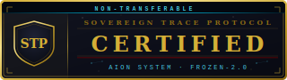
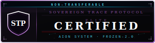
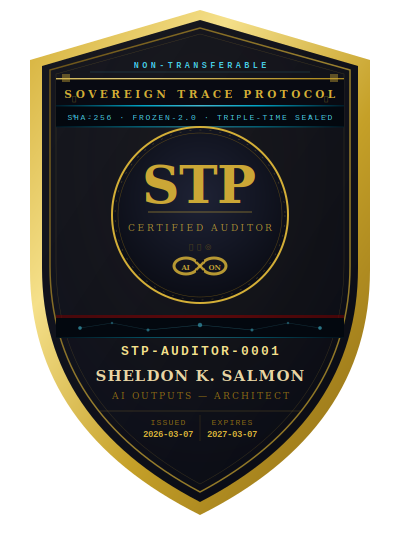

# CERTIFICATION.md — Sovereign Trace Protocol Certification

**Sovereign Trace Protocol · Version 2.0.0**
**Author: Sheldon K. Salmon — AI Reliability & AGI Architect**
**Effective: March 2026**
**Governing Law: State of New York, United States · Arbitration: JAMS Commercial Rules**

---

## ORIGIN OF THE MECHANISM

This protocol was built for individual sovereignty first. The stamp function was designed to give one person a permanent record of their own significant moments — no audience, no platform, no institution required.

The enterprise certification layer exists because the same mechanism that gives an individual temporal sovereignty over their personal record gives an organization cryptographic proof of their AI epistemic integrity. One stamp function. Two deployment scales. See `concept/USE-CASES.md`.

---

## WHAT CERTIFICATION IS

Installation is not certification. Running the ledger is not certification.

Certification is the formal verification that a deployment meets the
FROZEN-2.0 standard — a structured technical audit with a defined
deliverable: a signed assessment that the deployment is operating within
specification and producing trustworthy immutable records.

Four tiers. No negotiation on scope. No bundling.

The full five-phase audit process, Epistemic Debt framework, and
tamper-evidence benchmarks are documented in `AUDIT-METHODOLOGY.md`.

---

## INTAKE MODES

Two intake modes. Tier determines which applies.

**Automated Intake — Tier 1 and Tier 2**
24/7. File a `10-audit-request.yml` issue at any time. Payment via
Stripe is confirmed automatically by the audit-verify workflow before
any work begins. Badge delivered digitally upon certification. No call
required. No scheduling required. The filing and payment are the scope.

**Architect-Led Intake — Tier 3 and Tier 4**
Monday and Tuesday only. Submissions filed on any other day are not
processed that week. Delivery on the following weekend — reports
delivered Saturday or Sunday via scheduled reply on the issue thread.

Expedited delivery: daily multiplier applies. Work required in under
4 hours is not accepted. No exceptions.

Payment: Stripe transaction code required in the issue at filing.
Screenshot of the transaction sent to the contact email on file.
Both must match before work begins. No exceptions.

---

## TIER 1 — BASIC VERIFICATION

**$2,500 · Single engagement · 5–7 business days**

**Badge:** Standard — `badges/sovereign-certified-badge-v2.svg`

**What it covers:**
A single stamp check on a remediated failure. One AI failure event has
been logged in an immutable ledger. A remediation record has been appended.
The organization requires formal verification that the failure was captured
correctly and the remediation record is structurally sound.

**Deliverable:**
A signed Verification Statement from Sheldon K. Salmon specifying:
- Entry identifier of the audited failure
- Schema compliance assessment
- Remediation record assessment (complete / incomplete / deficient)
- Epistemic status: *Verified clean* or *Epistemic debt outstanding*

**What it does not cover:**
System-wide deployment review. Ongoing monitoring. Badge licensing.
Access to the AION-Registry.

**How to engage:**
File a `10-audit-request.yml` issue. Select Tier 1. Include the entry
identifier, organization name, and Stripe transaction code. The
audit-verify workflow confirms payment automatically. Assessment begins
within one business day of confirmation. No call. No scheduling.
Automated intake — available 24/7.

---

## TIER 2 — ENTERPRISE CERTIFICATION

**$25,000 per year · Annual renewal · 30-day assessment window**

**Badge:** Digital — `badges/sovereign-certified-badge-digital-v2.svg`

**What it covers:**
Full implementation audit across the organization's AI deployment
footprint — ledger configuration, scoring methodology, schema compliance,
and remediation posture. Upon completion, the organization receives
licensed use of the **Sovereign Certified Digital** badge for one year.

**Deliverable:**
- Full Enterprise Certification Report (written, signed, PDF)
- Sovereign Certified Digital badge license (digital, version-locked)
- Listing in the public AION-Registry at Enterprise tier
- Annual recertification reminder at 330 days

**The Sovereign Certified badge:**
Use of this badge without a current certification license constitutes
misrepresentation of audit status. The AION-Registry is the public
source of truth. Badge license terms are included in the Certification
Report. See `TRADEMARK.md` for mark usage restrictions.

**What it does not cover:**
Consulting, implementation support, or developer access. The audit
assesses what was built. Questions about findings are answered in
writing via the issue tracker. Zero-Consultation Rule applies.

**How to engage:**
File a `10-audit-request.yml` issue marked Tier 2. Include organization
name, AI deployment scope (one paragraph), and Stripe transaction code.
The audit-verify workflow confirms payment automatically. The Architect
opens the 30-day assessment window within two business days of
confirmation. Engagements are taken sequentially.
Automated intake — available 24/7.

---

## TIER 3 — STRATEGIC RETAINER

**$100,000+ per year · Terms negotiated in writing · C-Suite**

**Badge:** Elite — `badges/sovereign-certified-badge-elite-v2.svg`

**What it covers:**
Standing certification and monitoring posture for organizations
deploying AI in regulated industries, critical infrastructure, or
high-liability environments.

Components:
- Quarterly ledger reviews (four per year, written reports)
- Priority Tier 1 verification (48-hour turnaround)
- Private filing window: up to 21 days before mandatory public disclosure
- Named entry in AION-Registry at Strategic tier (public)
- Annual Strategic Certification Report — full epistemic debt assessment
- Direct written access to Architect for material findings
  (response within 5 business days, in writing, on record)
- Foresight Seal access: quarterly sealed foresight briefings on AI risk
  vectors and industry developments specific to the organization's deployment
  footprint — delivered as sealed ledger entries with the organization as
  named subject

**Epistemic Debt Statement:**
Organizations at this tier receive an annual Epistemic Debt Statement —
a plain-language assessment of accumulated AI audit record: failures
logged, remediations completed, outstanding debt, and trend direction.
A summary version is published to the AION-Registry.
See `AUDIT-METHODOLOGY.md` for the full Epistemic Debt framework.

**Minimum engagement:**
$100,000 base. Final terms depend on deployment footprint, ledger
volume, and industry classification.

**How to engage:**
File a `10-audit-request.yml` issue marked Tier 3 with organization
name and AI deployment scope (one paragraph). Architect-led intake —
Monday and Tuesday only. The Architect responds with initial terms
in writing. That exchange is the negotiation.

---

## TIER 4 — DEFENSE & GOVERNMENT GRADE

**Price: Negotiated · Engagement: Written contract required · Clearance: As applicable**

**Badge:** Defense — `badges/sovereign-certified-badge-defense-v2.svg`

**What it covers:**
Full standards-alignment certification for federal agencies, DoD components,
defense contractors, intelligence community elements, and critical infrastructure
operators subject to federal AI governance requirements.

Components:
- All Tier 3 components included
- Standards Alignment Report — maps deployment against all 18 frameworks in
  `STANDARDS-ALIGNMENT.md`, delivered as a signed, sealed PDF
- NIST AI RMF function mapping: GOVERN · MAP · MEASURE · MANAGE
- CMMC 2.0 control alignment report for DoD contractors
- EU AI Act Article 12 compliance documentation for dual-jurisdiction deployments
- FAR/DFARS addendum — federal acquisition regulation compliance layer
- Monthly ledger reviews (twelve per year) in place of quarterly
- SCIF-compatible written delivery — all reports delivered in writing,
  no digital transmission required if specified in engagement terms
- Named entry in AION-Registry at Defense & Government tier (public)
- Classified deployment support — engagement terms specify handling of
  sensitive information consistent with applicable clearance requirements

**Epistemic Debt Statement — Defense Edition:**
Quarterly epistemic debt statements in place of annual. Includes
standards compliance delta: which frameworks were satisfied in the prior
quarter and which require remediation before the next review cycle.
See `AUDIT-METHODOLOGY.md` for the full Epistemic Debt framework.

**Who this is for:**
- Federal agencies implementing OMB M-24-10 AI governance programs
- DoD components deploying AI under EO 14110 and DoD AI Ethical Principles
- Defense contractors requiring CMMC 2.0 audit trail documentation
- Intelligence community elements under ICD 503
- Critical infrastructure operators under CISA AI Cybersecurity guidance
- Organizations subject to EU AI Act Article 12 (high-risk AI systems)
- Any organization where AI failure documentation has national security,
  regulatory, or treaty-level implications

**How to engage:**
File a `10-audit-request.yml` issue marked Tier 4 with organization
name, applicable regulatory frameworks, and AI deployment scope
(one paragraph). Architect-led intake — Monday and Tuesday only.
The Architect responds with initial terms in writing. Engagements
at this tier require a signed written agreement before any work
commences. No exceptions.

---

## STP CERTIFIED AUDITOR NETWORK

Beyond direct certification by the Architect, the Sovereign Trace Protocol
maintains a certified auditor network. STP Certified Auditors are independent
professionals authorized to conduct and file audit completions directly to the
ledger under their own badge number.

Full vetting process, skills assessment criteria, badge obligations, and
revocation procedure: `AUDITOR-VETTING-PROCESS.md`.

**The auditor badge:**

**Badge properties:**
- Non-transferable — bound to the auditor's name and LinkedIn permanently
- SHA-256 sealed at issuance — badge number is cryptographically anchored
- Term: 1 year from issuance — renewable by reapplication only
- Annual cap: 50 sealed audits per calendar year per badge
- Badge number format: `STP-AUDITOR-XXXX`

**Verification:**
Every audit completion is verified live against `.github/verified-auditors.json`
on submission. A badge not in the registry is not valid. Any audit completion
filed with an unverified badge number is permanently sealed in the ledger
with status `AUDITOR_UNVERIFIED` — public, immutable, and labeled as such.
The warning cannot be removed.

**Anti-bribery and integrity:**
Badge misuse, bribery, coercion, or falsified findings may be reported
by anyone using template `13-integrity-violation.yml`. Violations are sealed
permanently in the ledger. Revocation proceedings may be referred to legal
review outside of STP. No single party holds unilateral revocation authority —
structural limits are intentional.

**Revenue model:**
Auditors set their own pricing. A platform percentage applies to all
auditor-conducted engagements. Terms specified in the auditor agreement
issued at certification.

**How to apply:**
File a `12-auditor-application.yml` issue. Skills-based review only —
no credentials required. Demonstrated ability to assess AI outputs honestly
is the criterion. Applications reviewed Monday and Tuesday.
Not every application is accepted. There is no appeal process.
See `AUDITOR-VETTING-PROCESS.md` for full process and criteria.

---

## AION VERIFIED SIMULATOR

**Badge:** `badges/aion-verified-simulator-badge-v1.svg`

This badge certifies a specific simulation tool — not an organization, not an
individual. Issued under AION methodology by Sheldon K. Salmon, AI Reliability
Architect. Distinct from the STP certification tier structure: no intake fee,
no annual renewal. Issued once, bound to the tool version it certifies.

---

### What the Badge Certifies

Three axes must pass before the badge is issued.

**1. Physics Verified**
All physical laws, constants, and formulas used in the simulation are cited
against primary sources. Uncited formulas are not permitted. Every claim the
simulation makes about how the physical world behaves is traceable to a named
reference.

**2. Code Red-Teamed**
The simulation code is audited across multiple passes for logic errors, edge
cases, unit mismatches, and physical inaccuracies. Red team passes are counted
and recorded. No minimum pass count — but every issue found in every pass is
documented without exception.

**3. Output Peer-Reviewed**
Simulation outputs are reviewed against real-world data or authoritative
reference material. Outputs that cannot be verified against a known benchmark
are documented as unverified in the Red Team tab — not silently excluded.

The badge is not issued until all three axes are complete and documented.

---

### The Red Team Tab Requirement

Every AION Verified Simulator must contain a Red Team tab visible to users.
That tab must document:

- Total number of red team passes conducted
- Total number of issues found across all passes
- Each issue: what it was, when it was found, how it was resolved
- Outstanding issues if any remain, with explicit status

A badge displayed without a Red Team tab has not been legitimately issued.
The documentation is the certification — the badge is its public marker.

---

### Badge Properties

| Property | Value |
|----------|-------|
| Badge file | `badges/aion-verified-simulator-badge-v1.svg` |
| Version | v1.0 |
| Issued | March 2026 |
| Palette | Black · Gold (#D4AF37) · Cream (#F5E070) |
| Shape | Octagonal precision seal — 24 chronometer ticks |
| Motif | 3-cycle sine wave — physics simulation universal |
| Seal | NON-TRANSFERABLE · SHA-256 · STP SEALED |
| Issuer | Sheldon K. Salmon · AI Reliability Architect |
| Binding | Bound to specific tool and version — not transferable |

The sine wave motif is intentional. Physics simulation reduces to wave behavior
at sufficient abstraction. The chronometer ticks represent the precision standard —
24 divisions, no rounding.

---

### How to Verify a Simulator Badge

Three checks. All three must pass.

1. The badge links to this file or to the AionSystem certification verification page.
2. The simulator contains a Red Team tab documenting all issues found and resolved.
3. The simulator footer names: source reference, red team pass count, and issue count.

If any of these three are absent, the badge has not been legitimately issued.
A badge without traceable documentation is decoration, not certification.

Certification verification page: `https://aiongithubpages/certifications/`

---

### Difference from STP Certification

| Dimension | STP Certified | AION Verified Simulator |
|-----------|--------------|------------------------|
| Issued to | Organizations | Simulation tools |
| Palette | Amber (#F0A500) | Gold (#D4AF37) |
| Shape | Hexagonal shield | Octagonal precision seal |
| Subject | AI deployment infrastructure | Physics / engineering / scientific tools |
| Audit type | Failure capture + remediation posture | Citation · red team · peer review |
| Tiers | 4 tiers ($2.5K → DoD) | Single certification |
| Renewal | Annual | None — bound to tool version |

---

### Live Example

**Roller Coaster Physics Simulator**
Reference: Tony Wayne AP Physics Guide · 10 modules · 2 red team passes · 10 issues resolved
Authored by Sheldon K. Salmon × ALBEDO · March 2026
For: Saleem Raja Haja · AI Governance, Kuwait
View at: `/simulators/roller-coaster/`

---

## BADGE REFERENCE

| Tier / Type | Badge Variant | File |
|-------------|--------------|------|
| Tier 1 — Basic Verification | Standard | `badges/sovereign-certified-badge-v2.svg` |
| Tier 2 — Enterprise Certification | Digital | `badges/sovereign-certified-badge-digital-v2.svg` |
| Tier 3 — Strategic Retainer | Elite | `badges/sovereign-certified-badge-elite-v2.svg` |
| Tier 4 — Defense & Government Grade | Defense | `badges/sovereign-certified-badge-defense-v2.svg` |
| STP Certified Auditor | Auditor Shield | `badges/stp-auditor-badge-v2.svg` |
| AION Verified Simulator | Octagonal Precision Seal | `badges/aion-verified-simulator-badge-v1.svg` |

Badge files are hosted in the Sovereign Trace Protocol repository.
Licensed use only — see `TRADEMARK.md`. Badge license is included in
the Certification Report delivered at each tier.
Unlicensed display of any Sovereign Certified badge constitutes
misrepresentation of audit status.

All STP badges carry: `NON-TRANSFERABLE` · SHA-256 · FROZEN-2.0 · TRIPLE-TIME SEALED.
AION Verified Simulator badge carries: `NON-TRANSFERABLE` · SHA-256 · STP SEALED · v1.0.

---

## THE REMEDIATION PROCESS

A failure that has been remediated is not a clean record. It is a
complete record. Both entries — original failure and remediation —
are permanent. The certification assessment reviews both.

| State | Description | Certification Impact |
|-------|-------------|----------------------|
| `OPEN` | Failure logged, no remediation | Epistemic debt outstanding |
| `REMEDIATION_FILED` | Remediation record appended, pending | Conditionally certifiable |
| `REMEDIATION_VERIFIED` | Architect-verified | Certified clean on this entry |

A Tier 1 Verification moves an entry from `REMEDIATION_FILED` to
`REMEDIATION_VERIFIED`. Self-certification does not exist in this protocol.

---

## WHAT CERTIFICATION IS NOT

Certification is not a guarantee that AI systems will not fail.
They will.

Certification is verification that the organization has built
infrastructure that captures failures immutably, remediates them
transparently, and maintains an honest epistemic record.

An organization with a certified deployment and a high failure rate
is more trustworthy than an organization with no failures on record
and no ledger. The ledger with failures is honest.
The ledger with no failures may simply have no ledger.

The full Epistemic Debt framework — including the Debt Ledger schema,
five-phase audit process, and tamper-evidence benchmarks — is in
`AUDIT-METHODOLOGY.md`.

---

## GOVERNING TERMS

All certification engagements are subject to `TERMS-OF-SERVICE.md`.
By filing a certification issue, you agree to those terms in full.
Governing law: State of New York, United States.
Dispute resolution: JAMS Commercial Arbitration Rules.

---

*Sheldon K. Salmon · AI Reliability & AGI Architect · March 2026*
*Certification inquiries: file a `10-audit-request.yml` issue.*
*No other intake channel exists.*
