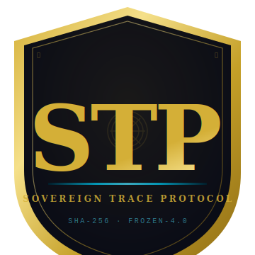
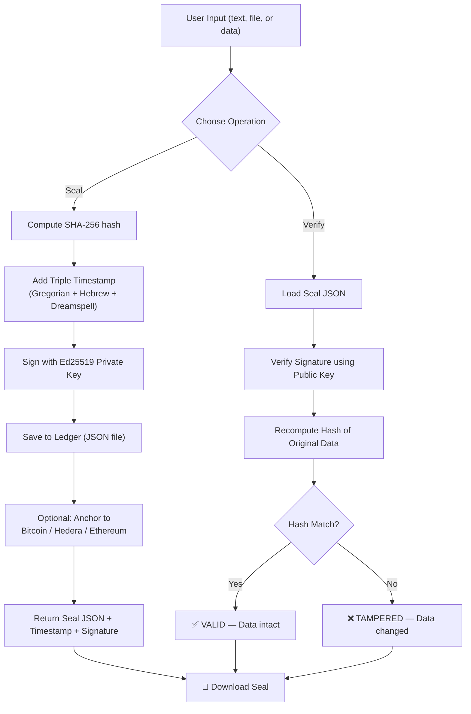

<div align="center">



<br/>

# SOVEREIGN TRACE PROTOCOL

### Permanence infrastructure for individuals and organizations.
### Seal what is true. Permanently. Across three civilizational time systems.

<br/>

[](https://orcid.org/0009-0005-8057-5115)
[](https://doi.org/10.5281/zenodo.18941392)
[](https://github.com/AionSystem/SOVEREIGN-TRACE-PROTOCOL)
[](https://github.com/AionSystem/SOVEREIGN-TRACE-PROTOCOL/actions)
[](https://github.com/AionSystem/SOVEREIGN-TRACE-PROTOCOL/actions)
[](https://pypi.org/project/sovereign-trace/)
[](https://github.com/AionSystem/AION-BRAIN)
[](https://www.hebcal.com)
[](https://github.com/AionSystem/SOVEREIGN-TRACE-PROTOCOL)
[](https://docs.python.org/3/library/index.html)
[](./LICENSE)
[](https://www.gnu.org/licenses/gpl-3.0)
[](./LICENSE-COMMERCIAL.md)
[](./LEGAL-POSTURE.md)

<br/>

> **→ [QUICKSTART.md](./QUICKSTART.md) — `pip install sovereign-trace` · First seal in under 5 minutes · Zero dependencies**

</div>

---

## Table of Contents

- [Overview](#overview)
- [Architecture at a Glance](#architecture-at-a-glance)
- [Quick Start](#quick-start)
- [Protocol Flow](#protocol-flow)
- [Who Seals What](#who-seals-what)
- [The Origin: From Personal to Enterprise](#the-origin-from-personal-to-enterprise)
- [The Triple-Time Seal](#the-triple-time-seal)
- [Epistemic Debt Score](#epistemic-debt-score)
  - [EDS Components](#eds-components)
  - [Worked Example — EDS: 67/100](#worked-example--eds-67100)
  - [Status Labels](#status-labels)
- [Submission Layer](#submission-layer)
- [Certification Tiers](#certification-tiers)
  - [Intake Rules](#intake-rules)
  - [STP Certified Auditors](#stp-certified-auditors)
- [Sample Audit Report](#sample-audit-report)
- [Frozen Declaration](#frozen-declaration)
  - [Frozen Lineage](#frozen-lineage)
- [Triple License](#triple-license)
- [Build Sequence](#build-sequence)
- [Repository Structure](#repository-structure)
- [Provenance](#provenance)

---

## Overview

**STP is dual-use permanence infrastructure.** The same cryptographic mechanism that gives an individual sovereignty over their own historical record gives an organization tamper-evident proof of its AI epistemic integrity.

**For individuals** — Write one entry capturing exact present-moment observations. Seal it with a triple-time cryptographic stamp that binds the moment simultaneously to Gregorian, Hebrew lunisolar, and 13 Moon Dreamspell calendars. The SHA-256 seal is permanent, tamper-evident, and requires no audience.

> The hunger for recognition of significance resolves at the moment the stamp is generated — not at the moment someone reads it.

**For organizations** — Every AI failure deserves a permanent, immutable record. Log it. Seal it. Append the remediation. The record cannot be edited after the fact. The AION-Registry holds public certification outcomes. An organization with a documented failure history and certified infrastructure is more trustworthy than one with a clean record and no ledger.

> See [`concept/USE-CASES.md`](./concept/USE-CASES.md) for the full dual-use architecture.

---

## Architecture at a Glance

| Dimension | Value |
|---|---|
| **Author** | Sheldon K. Salmon — AI Reliability & AGI Architect |
| **Session** | March 2026 — AION-BRAIN |
| **Stack** | DUAL-HELIX v2.0 · TOPOS v0.3 · VELA-C v0.3 · CPA-001 v2.2 |
| **Convergence** | M-NASCENT |
| **Core Mechanism** | SHA-256 · Triple-time stamp · Ed25519 signature |
| **Python Requirement** | 3.11+ |
| **External Dependencies** | Zero — stdlib only |
| **Stamp File Status** | FROZEN-4.0 — write-once, verify-once, deploy permanently |
| **Test Coverage** | 82 checks passing across 28 test suites |
| **License Model** | Apache 2.0 · GPL v3 · Commercial (triple-license) |

---

## Quick Start

```bash
pip install sovereign-trace
python
```

```python
from sovereign_trace_stamp import stamp, display, verify

ts = stamp("Hypothesis sealed before experiment begins.")
print(display(ts))
```

```
📅 Gregorian:  March 7, 2026
🌑 Hebrew:     17 Adar 5786
🌀 Dreamspell: Day 1, Solar Moon 9/13
🔒 Seal:       a3f9c12e7d...
📌 Version:    FROZEN-4.0
```

No configuration. No API keys. The stamp function works **offline**, requires **zero dependencies** beyond Python's standard library, and produces the same SHA-256 seal on any machine.

Full install guide, usage examples, and what not to do: [QUICKSTART.md](./QUICKSTART.md)

---

## Protocol Flow



---

## Who Seals What

The stamp function does not care what it seals. A sealed moment is a sealed moment. The SHA-256 proof is the same whether the content is an AI failure report, a research hypothesis, a hospital incident record, a contractor's agreed scope, or a professional foresight declaration.

| Who | What They Seal | Why It Matters |
|---|---|---|
| **AI auditor** | AI system output failure — exact text + screenshots | Public permanent record. Organizational accountability. Tamper-evident before remediation. |
| **AI developer / company** | Prompt deployed in a product before launch | If the prompt causes harm later, the sealed record proves what was authorized and when. No dispute about what the system was told to do. |
| **AI framework builder** | Framework specification before publishing or citing | Priority record for AI methodology. Proves the design existed before any implementation or competing claim. |
| **AI evaluator** | Benchmark before running it against a model | Prevents benchmarks being quietly modified after results are known. The sealed version is the one that was tested. |
| **AI trainer** | Dataset declaration before training begins | When model behavior is disputed, the sealed declaration proves what data was authorized. |
| **Researcher / scientist** | Hypothesis before running the experiment | Proves prediction preceded results. Kills HARKing (Hypothesizing After Results are Known). Every field. No institution required. |
| **Journalist** | Article draft · Source document received · Evidence chain before going to print | Proves what you had and when you had it. If a source is pressured to recant — the sealed record shows what they said before the pressure. |
| **Whistleblower** | Evidence before going public | Chain of custody proof. Proves the document was not altered between receipt and disclosure. |
| **Musician / artist / writer** | Creative work before release or submission | Timestamped proof of authorship. Not a patent — cryptographic priority proof that costs nothing and requires no lawyer. |
| **Independent researcher** | Findings before peer review | Priority claim before submission. Prevents being scooped or findings disputed after publication. |
| **Negotiator** | Your position before a difficult conversation | Seal what you were willing to accept before the other party claims you moved the goalposts. Salary. Settlement. Term sheet. |
| **Contractor / freelancer** | Project scope before work begins | Immutable record of what was agreed. Scope creep disputes resolved by the sealed ledger entry. |
| **Hospital / clinical team** | Clinical trial data before analysis · Incident report before review | Proves data integrity before results are known. FDA 21 CFR Part 11 compatible architecture. |
| **FOIA researcher / archivist** | Declassified document at point of receipt | Proves the released version has not been altered after declassification. The seal is the chain of custody from institution to researcher. |
| **NASA / space agency** | Mission parameter file before launch · Research findings before peer review | If a mission fails and a specification dispute arises — the sealed pre-launch document is the ground truth. |
| **Teacher / educator** | Student work at time of submission | Proves the student submitted exactly this, on this date, unchanged. No dispute about post-deadline alterations. |
| **Therapist / clinician** | Session notes at time of writing | If notes are subpoenaed, the seal proves they were not altered retroactively. Integrity of the clinical record at the moment of documentation. |
| **Estate / legal** | Intentions before a will is formalized | Not a legal substitute — a tamper-evident record of what was wanted, sealed at the moment of decision, before institutional processes began. |
| **Organization (any)** | AI failure log entry before remediation | Immutable pre-remediation record. Proves the organization documented honestly before fixing — not after. |
| **Foresight analyst / strategist** | Dated professional prediction before it resolves | Cryptographic proof you saw it first. A track record of correct sealed predictions — verifiable by anyone — cannot be fabricated after the fact. |

The mechanism is always the same. The stake determines how you use the sealed record afterward.

---

## The Origin: From Personal to Enterprise

The enterprise use case was not designed first.

The protocol was built to solve a personal problem: how does one individual permanently register their own significant moments without requiring an audience, a platform, or institutional permission?

The answer — a frozen, tamper-evident, triple-time cryptographic seal — turned out to be exactly what organizations need for their AI audit trail. The mechanism that gives an individual temporal sovereignty over their own record also gives an organization cryptographic proof of their epistemic integrity.

---

## The Triple-Time Seal

The triple stamp is not redundancy. It is a claim: this moment of human significance deserves to be held simultaneously in every major civilizational framework for measuring *when*.

| System | Example | What It Claims |
|---|---|---|
| **Gregorian** | March 7, 2026 | Civic time — the calendar of current civic infrastructure |
| **Hebrew lunisolar** | 17 Adar 5786 | Theological-historical continuity — 5,786 years of counted time |
| **13 Moon Dreamspell** | Day 1, Solar Moon 9/13 | Rhythmic time — 13 moons × 28 days, galactic count |

---

## Epistemic Debt Score

Every certified organization receives an **Epistemic Debt Score (EDS)** — a 0–100 metric measuring AI epistemic integrity across five independently scored components. The full formula is public: [EPISTEMIC-DEBT-SCORE.md](./EPISTEMIC-DEBT-SCORE.md).

The EDS does not measure whether AI systems fail. It measures whether an organization has built the infrastructure to document failures honestly, resolve them completely, and improve over time.

> Silence is not a clean record. It is an unscored one.

### EDS Components

| Component | Weight | What It Scores |
|---|---|---|
| **C1 — Completeness** | 20 pts | Does ledger volume match actual deployment scale? |
| **C2 — Remediation Rate** | 20 pts | What fraction of sealed failures are verified-resolved? |
| **C3 — Severity Discipline** | 20 pts | Are critical and high issues closed within resolution windows? |
| **C4 — Trend Direction** | 20 pts | Is the organization improving period-over-period? |
| **C5 — Proactive Reporting** | 20 pts | Near-misses filed before mandatory reporting triggers? |

Three of the five components (C2, C3, C5 base) are computed directly from the public ledger JSON and are **independently verifiable** by any party with Python 3.11+. The formula is public. The tool is proprietary.

### Worked Example — EDS: 67/100

*A mid-size consumer AI company. 14 months of operation. Medium domain risk. First formal audit.*

```
EPISTEMIC DEBT SCORE — [Redacted: Consumer AI Platform]
Assessment date: March 7, 2026
Period: January 1, 2025 – March 7, 2026

C1  Completeness            12 / 20   Ledger volume thin relative to deployment scale.
                                       Completeness ratio: 0.51 — significantly below proportionate.
                                       Architect note: monitoring coverage partial; 3 of 7 subsystems
                                       had no logging configured at audit open.

C2  Remediation Rate        14 / 20   21 of 28 sealed failures carry REMEDIATION VERIFIED status.
                                       75% rate. 4 open items are HIGH severity, 3 are MEDIUM.
                                       Trivial failure penalty not triggered (trivial ratio: 0.11).

C3  Severity Discipline     16 / 20   2 HIGH items overdue past 60-day window (−2 each = −4).
                                       0 CRITICAL items open. MEDIUM items all within window.

C4  Trend Direction         20 / 20   Prior period remediation rate: 61%. Current: 75%. Delta: +14%.
                                       Improving. No burst-filing pattern detected.

C5  Proactive Reporting      5 / 20   1 near-miss filed (score: 4). 1 pre-deadline voluntary
                                       disclosure (adjustment: +2). Near-miss verification: valid.
    ─────────────────────────────────
    TOTAL                   67 / 100

Status:  EPISTEMIC DEBT OUTSTANDING
Seal:    SHA-256 · [sealed at certification close]
```

**What 67 means in plain language:** The organization documents. It resolves most of what it documents. It is improving. It is not yet disciplined about severity triage — two high-severity items sat unresolved past the 60-day window, which in a regulated environment would be a breach of internal SLA. The ledger is thin relative to deployment scale, which is the single largest drag on the score. The path to EPISTEMIC DEBT MANAGEABLE (75+) runs through two actions: expand monitoring coverage so the ledger reflects actual failure volume, and close the two overdue HIGH items.

### Status Labels

| Score | Label | What It Signals |
|---|---|---|
| 90–100 | **CERTIFIED CLEAN** | Exemplary epistemic discipline |
| 75–89 | **EPISTEMIC DEBT MANAGEABLE** | Documented, resolving, improving |
| 50–74 | **EPISTEMIC DEBT OUTSTANDING** | Documenting but gaps remain |
| < 50 | **UNCERTIFIABLE** | Insufficient discipline for certification |
| — | **UNSCORED** | No ledger data — cannot evaluate |

---

## Submission Layer

Structured submissions are made through GitHub Issues using the official template set. Each template produces a structured, legally-declared record before sealing. Blank issues are disabled — every submission uses a template.

| # | Template | Use Case |
|---|---|---|
| 01 | `01-ai-failure.yml` | AI system output failure — identity verified, legal declaration required |
| 02 | `02-research-priority.yml` | Hypothesis or finding before results are known |
| 03 | `03-evidence-chain.yml` | Document or source communication at point of receipt |
| 04 | `04-creative-priority.yml` | Creative work — music, writing, art, design, code |
| 05 | `05-clinical-record.yml` | Clinical incident, trial data, or institutional record — PHI gate active |
| 06 | `06-scope-anchor.yml` | Agreed scope or negotiated position before work begins |
| 07 | `07-general-trace.yml` | Any observation, decision, or record that doesn't fit another template |
| 08 | `08-foresight-seal.yml` | Dated professional prediction before it resolves — foresight track record |
| 09 | `09-webeater-link.yml` | Cryptographic link between two entities — binds a new seal to an existing SHA-256 |
| 10 | `10-audit-request.yml` | Request a certified audit |
| 11 | `11-audit-completion.yml` | STP Certified Auditor files a completed audit to the ledger |
| 12 | `12-auditor-application.yml` | Apply to become an STP Certified Auditor — skills-based, no credentials required |
| 13 | `13-integrity-violation.yml` | Report badge misuse, bribery, or coercion — permanent ledger record |
| 14 | `14-near-miss.yml` | AI output that almost caused harm — caught before impact |
| 15 | `15-prompt-seal.yml` | Seal a prompt before deploying it to production |
| 16 | `16-model-weights-seal.yml` | Seal the SHA-256 hash of AI model weights before release or training |
| 17 | `17-dataset-declaration.yml` | Seal a dataset checksum and description before training begins |
| 18 | `18-agreement-seal.yml` | Seal a term sheet, contract, or handshake agreement before formalization |
| 19 | `19-release-seal.yml` | Seal a software release — commit hash, artifact checksums, and release notes |
| 20 | `20-decision-record.yml` | Seal an architectural, governance, or board decision at the moment it is made |
| 21 | `21-vulnerability-timeline.yml` | Seal the exact timeline of a discovered vulnerability — discovery, disclosure, patch |
| 22 | `22-ai-output-sample.yml` | Seal a representative sample of AI outputs for periodic self-monitoring |

All templates include: native file upload, SHA-256 binding, declaration checkbox, and legal compliance language.

See [concept/USE-CASES.md](./concept/USE-CASES.md) for guidance on which template fits your submission.

**New to GitHub?** → [HOW-TO-SUBMIT.md](./HOW-TO-SUBMIT.md) — plain English guide, no experience required.

---

## Certification Tiers

| Tier | Scope | Price | Badge | Deliverables | Intake |
|---|---|---|---|---|---|
| **Tier 0 — Snapshot Verification** | 10 outputs, pre-audit trust signal | Free | Snapshot (pearl/earth) | Snapshot report · Ledger entry · Badge embed code | Automated 24/7 |
| **Tier 1 — Full Audit** | 25–1,000+ outputs, output-banded pricing, 3-month validity | $1,500–$50K | Standard | Sealed audit report (PDF) · EDS scorecard · Ledger entry · Standard badge embed code | Architect-led · Mon–Tue only |
| **Tier 2 — Enterprise Retainer** | Quarterly audits, continuous compliance | $25K/yr | Digital | Quarterly sealed reports · EDS trend dashboard · Ledger entries · Digital badge embed code | Automated 24/7 |
| **Tier 3 — Strategic Retainer** | All Tier 2 + priority access + Foresight Seal | $100K+/yr | Elite | All Tier 2 deliverables · Priority SLA · Foresight Seal registration · Elite badge embed code | Architect-led · Mon–Tue only |
| **Tier 4 — Defense & Government Grade** | Full standards alignment, monthly reviews, SCIF-compatible | On request | Defense | Monthly sealed reports · Standards alignment matrix · Ledger entries · Defense badge embed code | Architect-led · Mon–Tue only |
| **Tier 5 — Sovereign AI Audit** | 7-instrument adversarial stack, 14-day window | $15K | Sovereign (cyan/indigo) | Full adversarial audit report · 7-instrument findings · EDS scorecard · Sovereign badge embed code | Architect-led · Mon–Tue only |

### Intake Rules

- **Tier 0 and Tier 2** — submit anytime via `10-audit-request.yml`
- **Tier 1, 3, 4, and 5** — Architect-led. Intake **Monday and Tuesday only.** Submissions on other days are voided and non-refundable.
- **Delivery:** Weekends for all tiers.

Tier 5 (Sovereign AI Audit) runs the complete AION adversarial stack — seven instruments in sequence — against the client's AI system. It is a full-scale diagnostic, adversarial, and code-level audit, not a management-system paperwork review. See [CERTIFICATION.md](./CERTIFICATION.md) for the complete instrument list and deliverable schedule.

### STP Certified Auditors

Independent professionals authorized to conduct and file audits directly to the ledger under their own badge. Apply via `12-auditor-application.yml`. See [AUDITOR-VETTING-PROCESS.md](./AUDITOR-VETTING-PROCESS.md) for the full vetting process. All auditor badges are verified live against `.github/verified-auditors.json` on every submission.

See [CERTIFICATION.md](./CERTIFICATION.md), [AUDIT-METHODOLOGY.md](./AUDIT-METHODOLOGY.md), and [TERMS OF SERVICE.md](./TERMS%20OF%20SERVICE.md) for full process and terms.

**Governing law:** State of New York, United States. Arbitration: JAMS Commercial Rules.

---

## Sample Audit Report

Before committing $1,500–$50K, hold the product.

A fully worked, anonymized Tier 1 audit output is available at [SAMPLE-AUDIT-REPORT.md](./SAMPLE-AUDIT-REPORT.md). It shows:

- The EDS scorecard with component-level breakdown
- Instrument readings across the AION stack
- A findings table with severity classifications and remediation status
- The sealed ledger entry format
- The badge embed code delivered at audit close

The sample report is not a brochure. It is a redacted real output — the exact format, the exact findings structure, the exact deliverable a Tier 1 client receives. Read it before you decide.

---

## Frozen Declaration

`sovereign_trace_stamp.py` is **FROZEN-4.0**. Written once, verified once, deployed permanently. No patches. No updates. The stamp it generates is only permanent if the code that generates it is also permanent.

**If a defect is found:** retire the frozen file, archive it as `SOVEREIGN-TRACE-STAMP-FROZEN-4.0-RETIRED.py`, document the defect, build FROZEN-5.0 from first principles, re-verify all anchor cases. Never patch.

### Frozen Lineage

| Version | Status | Primary Defect |
|---|---|---|
| **FROZEN-1.0** | Retired | Incomplete dehiyot implementation — Hebrew off-by-one on all 5786 dates |
| **FROZEN-2.0** | Retired | Eight defects including: no NFC normalization, no version field in seal, pre-reform boundary slip, unbounded Hebrew year loop |
| **FROZEN-3.0** | Retired | Self-test anchor dates for RH 5787 and Erev RH 5787 were wrong. Algorithm correct; test data was not. Effect: self-test raised `AssertionError` on otherwise correct code. |
| **FROZEN-4.0** | **Current** | All known defects resolved. 82 self-test checks passing. |

> All FROZEN-3.0 stamps remain cryptographically valid — the defect was in test data only. No stamp produced by any retired version carries a cryptographic error. (FROZEN-1.0 carries an incorrect Hebrew field; its seal is cryptographically valid but binds the wrong calendar string.)

---

## Triple License

| License | Applies To |
|---|---|
| **Apache 2.0** | Individual, academic, non-commercial use. Patent retaliation clause active. |
| **GPL v3** | Modified distributions. Copyleft — corporate forks must open-source modifications. |
| **Commercial** | White-label, certification services, SaaS. See [LICENSE-COMMERCIAL.md](./LICENSE-COMMERCIAL.md). |

Plain-language guide: [LICENSE-EXPLANATION.md](./LICENSE-EXPLANATION.md)

Full legal coverage: [LEGAL-POSTURE.md](./LEGAL-POSTURE.md)

---

## Build Sequence

```
STAGE 1 — COMPLETE (March 9, 2026)
  FROZEN-2.0: Triple-time stamp. Full dehiyot. Zero deps. 35 checks passed.
  PyPI: sovereign-trace 2.0.0 live. Founding seal in ledger.

STAGE 1 — RED TEAM + FROZEN-4.0 (June 1, 2026)
  Full red team scan: FSVE v4.3 × FA v4.0 dual-framework audit.
  1 CRITICAL finding (self-test anchor data), 3 MEDIUM, 4 LOW — all resolved.
  FROZEN-3.0 retired. FROZEN-4.0: 82 self-test checks passing.
  PyPI: sovereign-trace 4.0.0 — pending push.

STAGE 2 — PLANNED
  Local encrypted vault integration (Obsidian / Notion)

STAGE 3 — PLANNED
  Ledger append layer (Thirdweb / Hedera) + multi-destination relay

STAGE 4 — PLANNED
  Optional resonance signature mechanism — zero count display
```

---

## Repository Structure

```
sovereign-trace-protocol/
│
├── README.md
├── CHANGELOG.md
├── REPO-STRUCTURE.md
├── STP-logo.svg
├── QUICKSTART.md
├── HOW-TO-SUBMIT.md
├── SAMPLE-AUDIT-REPORT.md
├── CERTIFICATION.md
├── AUDIT-METHODOLOGY.md
├── AUDITOR-VETTING-PROCESS.md
├── EPISTEMIC-DEBT-SCORE.md
├── STANDARDS-ALIGNMENT.md
├── DISASTER-RECOVERY.md
├── NON-RECOURSE-STATEMENT.md
├── METHODOLOGY.md
├── PRINCIPLES.md
├── LEGAL-POSTURE.md
├── ACCEPTABLE-USE-POLICY.md
├── AI-ETHICS-STATEMENT.md
├── PRIVACY-POLICY.md
├── EXPORT-CONTROL.md
├── SECURITY.md
├── SECURITY-INSIGHTS.yml
├── CONTRIBUTOR-TERMS.md
├── CONTRIBUTOR-LICENSE-AGREEMENT.md
├── DATA-PROCESSING-AGREEMENT.md
├── MUTUAL-NDA.md
├── UNILATERAL-NDA.md
├── PATENTS.md
├── TRADEMARK.md
├── TRADEMARK-USAGE-POLICY.md
├── LICENSE
├── LICENSE-COMMERCIAL.md
├── LICENSE-EXPLANATION.md
├── LICENSE-GPLv3.md
├── NOTICE
├── TERMS OF SERVICE.md
├── CITATION.cff
├── pyproject.toml
├── pytest.ini
│
├── .github/
│   ├── FUNDING.yml
│   ├── SECURITY.md
│   ├── verified-auditors.json
│   ├── revoked-auditors.json
│   ├── ISSUE_TEMPLATE/
│   │   ├── config.yml
│   │   ├── 01-ai-failure.yml          — AI output failure
│   │   ├── 02-research-priority.yml   — Hypothesis priority
│   │   ├── 03-evidence-chain.yml      — Evidence at receipt
│   │   ├── 04-creative-priority.yml   — Creative authorship
│   │   ├── 05-clinical-record.yml     — Clinical / PHI gate
│   │   ├── 06-scope-anchor.yml        — Scope agreement
│   │   ├── 07-general-trace.yml       — General record
│   │   ├── 08-foresight-seal.yml      — Foresight prediction
│   │   ├── 09-webeater-link.yml       — Cryptographic link
│   │   ├── 10-audit-request.yml       — Audit intake
│   │   ├── 11-audit-completion.yml    — Auditor filing
│   │   ├── 12-auditor-application.yml — Auditor application
│   │   ├── 13-integrity-violation.yml — Badge misuse report
│   │   ├── 14-near-miss.yml           — Near-miss report
│   │   ├── 15-prompt-seal.yml         — Prompt pre-deploy
│   │   ├── 16-model-weights-seal.yml  — Model weights hash
│   │   ├── 17-dataset-declaration.yml — Dataset pre-train
│   │   ├── 18-agreement-seal.yml      — Term sheet / contract
│   │   ├── 19-release-seal.yml        — Software release
│   │   ├── 20-decision-record.yml     — Governance decision
│   │   ├── 21-vulnerability-timeline.yml — CVE timeline
│   │   └── 22-ai-output-sample.yml    — Self-monitoring sample
│   └── workflows/
│       ├── python-publish.yml
│       ├── auto-seal.yml
│       └── audit-verify.yml
│
├── assets/
│   ├── img/
│   │   ├── aion-logo.jpg
│   │   └── favicon.svg
│   ├── badges/
│   │   ├── sovereign-certified/
│   │   │   ├── sovereign-certified-badge-v2.svg
│   │   │   ├── sovereign-certified-badge-digital-v2.svg
│   │   │   ├── sovereign-certified-badge-elite-v2.svg
│   │   │   ├── sovereign-certified-badge-defense-v2.svg
│   │   │   ├── sovereign-certified-badge-snapshot-v1.svg
│   │   │   └── sovereign-certified-badge-sovereign-v1.svg
│   │   ├── stp_auditor/
│   │   │   ├── stp_auditor_badge_sheldon_v1.svg
│   │   │   ├── stp_auditor_template_v1.svg
│   │   │   └── stp_senior_auditor_template_v1.svg
│   │   ├── compliance/
│   │   │   ├── compliance-constitutional-badge.svg
│   │   │   ├── compliance-finance-badge.svg
│   │   │   ├── compliance-healthcare-badge.svg
│   │   │   └── compliance-legal-badge.svg
│   │   └── verified-simulator/
│   │       ├── aion-verified-simulator-badge-v1.svg
│   │       └── aion-verified-simulator-badge-v2.svg
│   └── sleeve/
│       ├── big-sleeve/
│       └── small-sleeve/
│
├── concept/
│   ├── GLOSSARY.md
│   ├── USE-CASES.md
│   ├── DUAL-AUDIENCE-ARCHITECT.md
│   ├── TRUST-WITHOUT-IDENTITY.md
│   ├── PRIOR-ART.md
│   ├── WEBEATER-SPEC.md
│   ├── SUBMISSION-TEMPLATE.md
│   ├── SOVEREIGN-TRACE-v0.1-SPEC.md
│   ├── SOVEREIGN-TRACE-v0.2-SPEC.md
│   ├── SOVEREIGN-TRACE-v0.3-SPEC.md
│   └── SOVEREIGN-TRACE-v0.4-SPEC.md
│
├── sovereign_trace/
│   ├── __init__.py
│   ├── sovereign_trace_stamp.py       ← FROZEN-4.0 — do not modify
│   ├── FROZEN-4.0-MANIFEST.md
│   ├── FROZEN-3.0-RETIRED/
│   ├── FROZEN-2.0-RETIRED/
│   └── FROZEN-1.0-RETIRED/
│
├── ledger/
│   └── [sealed ledger entries — append-only]
│
└── tests/
    ├── conftest.py
    ├── test_async_stamp.py
    ├── test_backward_compat.py
    ├── test_cli.py
    ├── test_concurrency.py
    ├── test_display.py
    ├── test_dreamspell_calendar.py
    ├── test_file_integrity.py
    ├── test_frozen_version.py
    ├── test_gregorian.py
    ├── test_hebrew_anchors.py
    ├── test_hebrew_calendar.py
    ├── test_hebrew_edge_cases.py
    ├── test_jd_bridge.py
    ├── test_package_imports.py
    ├── test_performance.py
    ├── test_properties.py
    ├── test_regression.py
    ├── test_self_test_runner.py
    ├── test_serialization.py
    ├── test_sovereign_record_class.py
    ├── test_sovereign_stamp_class.py
    ├── test_stamp_and_record.py
    ├── test_stamp_batch.py
    ├── test_stamp_core.py
    ├── test_stamp_datetime_handling.py
    ├── test_stamp_error_handling.py
    ├── test_stamp_normalization.py
    ├── test_verify.py
    ├── test_verify_result.py
    └── REPORTS/
```

---

## Provenance

<div align="center">

| Field | Value |
|---|---|
| **Author** | Sheldon K. Salmon — AI Reliability & AGI Architect |
| **ORCID** | [0009-0005-8057-5115](https://orcid.org/0009-0005-8057-5115) |
| **Session** | March 2026 — AION-BRAIN |
| **Stack** | DUAL-HELIX v2.0 · TOPOS v0.3 · VELA-C v0.3 · CPA-001 v2.2 |
| **DOI** | [10.5281/zenodo.18941392](https://doi.org/10.5281/zenodo.18941392) |

*The stamp is permanent. The stamp is the resolution.*

</div>

---

<div align="center">

[↑ Back to top](#sovereign-trace-protocol)

</div>
